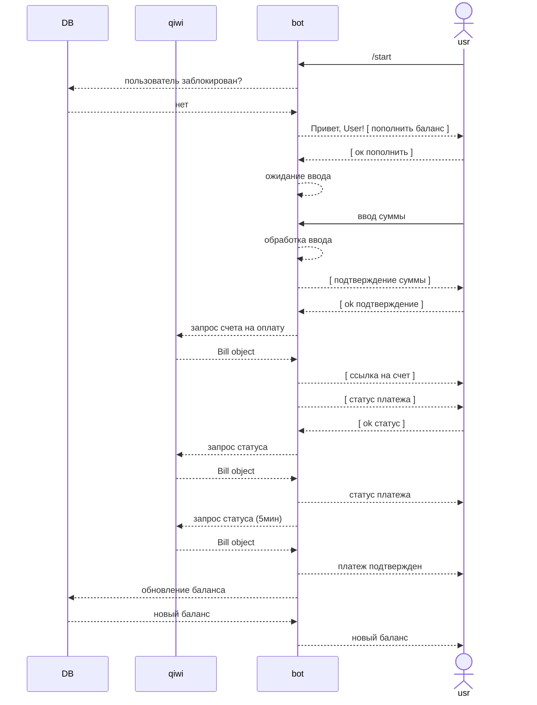

## Требования:

- Telegram API: aiogram
- Платежная система: pyqiwip2p2
- Логирование: logger
- СУБД: sql (mysql, postgres)
- Срок: 5 дней

## Задача:

### Телеграм бот

Команды:
- `/start` запуск
- `/admin` вход в админ панель

При нажатии на команду `/start` пользователю приходит шаблонное сообщение такого типа:

Сообщение пользователю:

    Привет, {имя пользователя}
    Я - бот для пополнения баланса.
    Нажмите на кнопку, чтобы пополнить баланс

Снизу инлайн кнопка с текстом `Пополнить баланс`

При нажатии на кнопку пополнения баланса:

Сообщение пользователю: 

    Введите сумму, на которую вы хотите пополнить баланс

- Получать сумму от пользователя и создавать киви счёт с полученной суммой (lifetime 5 минут)

Две кнопки прикрутить к сообщению об успешном создании платежа:
- `ссылкой на оплату счета`
- `прошёл ли платеж` 
    - если да - записывать сумму в баланс пользователя в боте, 
    - если нет - писать, что платеж не прошёл

`/admin` делайте на свое усмотрение. 

Главные задачи админки:
- выгрузка пользователей с их балансом
- возможность изменить баланс пользователя
- возможность заблокировать пользователя (бот перестает обрабатывать сообщение пользователя)
- выгрузка логов

