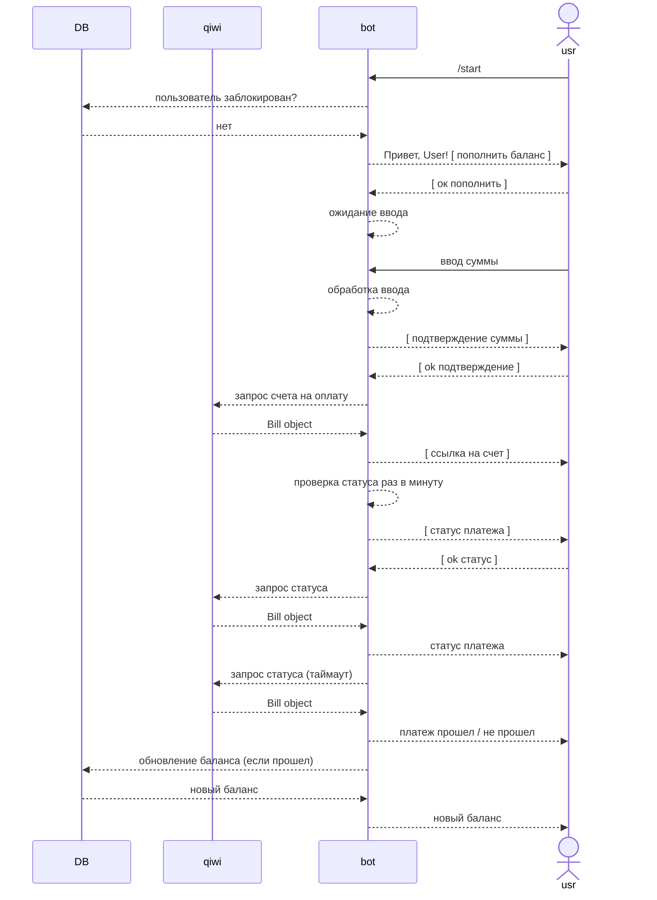

# Задача: прототип телеграм бота для пополнения баланса

### Требования:

- Telegram API: aiogram
- Платежная система: pyqiwip2p2
- Логирование: logger
- СУБД: sql (mysql, postgres)
- Срок: 5 дней


## Телеграм бот

Команды:
- `/start` запуск
- `/admin` вход в админ панель

При нажатии на команду `/start` пользователю приходит шаблонное сообщение:

    Привет, {имя пользователя}
    Я - бот для пополнения баланса.
    Нажмите на кнопку, чтобы пополнить баланс

Снизу инлайн кнопка с текстом `Пополнить баланс`

При нажатии на кнопку пополнения баланса и сообщение пользователю: 

    Введите сумму, на которую вы хотите пополнить баланс

Далее получение суммы от пользователя и создание киви счёта (lifetime 5 минут) с полученной суммой.

Две кнопки прикрутить к сообщению об успешном создании платежа:
- `ссылка на оплату счета`
- `прошёл ли платеж` 
    - если да - записывать сумму в баланс пользователя в боте, 
    - если нет - писать, что платеж не прошёл

`/admin` делайте на свое усмотрение. 

## Админ панель
Главные задачи админки:
- выгрузка пользователей с их балансом
- возможность изменить баланс пользователя
- возможность заблокировать пользователя (бот перестает обрабатывать сообщение пользователя)
- выгрузка логов


# Решение
## Сценарий взаимодействия

При обращении пользователя к боту каждый раз осуществляется проверка права доступа пользователя. Если пользователь не заблокирован - происходит дальнейшее взаймодействие. В противном случае ничего не происходит.

- При вызове команды `/start` выводится приветствие с кнопкой [ Пополнить баланс ]. При нажатии на кнопку бот предлагает ввести сумму и переходит в состояние ожидания ввода суммы. 

    - При получении ответного сообщения от пользователя, осуществляется попытка конвертации текста сообщения в целое число.

        - Если конвертация прошла успешно - бот отправляет сообщение пользователю с запросом на подтверждение обработанной суммы. Либо отмена*.

            - Если пользователь подтверждает, то бот выполняет запрос на создание нового qiwi платежа.

                - Если ответ от qiwi получен - бот отправляет сообщение пользователю со ссылкой на платеж, кнопкой проверки статуса платежа и запускает автоматический цикл проверки платежа (раз в минуту отправляется запрос статуса).

                    - Если полученный статус равен `"WAITING"` - бот сообщает, что счет ожидает оплаты (если статус получен по кнопке) и продолжает ждать.

                    - Если полученный статус (автоматический или по кнопке) равен `"PAID"`, то есть оплачен - бот создает новую запись с данными счета в базе, прибавляет сумму счета к балансу пользователя в базе, и отправляет сообщение о том, что платеж прошел успешно, с новым балансом.

                    - Если время жизни qiwi платежа превысило лимит ожидания, либо был получен один из статусов `["REJECTED", "EXPIRED"]`, то бот отравляет соответсвующее сообщение и перезагружает диалог.

                    - Если полученный статус не известен боту (например изменилось api) - бот сообщает об этом и продолжает ждать пока счет будет оплачен, либо истечет лимит ожидания.

                - Если возникла ошибка - бот отправляет сообщение `"Что-то пошло не так. Отчет отправлен в службу поддержки."` и перезагружает диалог.

        - Если не удалось конвертировать - бот отправляет сообщение о неверном вводе, уточняет, что нужно сделать и предлагает ввести сумму еще раз. Либо отмена*.

- При вызове команды `/admin` выводится сообщение со ссылкой на админку. 

\* отмена всегда равносильна перезагрузке диалога или вызову кнопки `/start`.


## Админ панель

Кнопки выгрузки данных (желтого цвета) находятся в django-admin.

## Запуск

1. Создайте виртуальное окружение и установите зависимости.
```bash
$ python3 -m venv venv
$ source venv/bin/activate
(venv) $ python -m pip install -r requirements.txt
```

2. Создайте базу данных
```
$ sudo -u postgtes psql
postgres=# CREATE DATABASE название_базы_данных;
postgres=# CREATE USER имя_пользователя WITH PASSWORD 'пароль';
postgres=# ALTER ROLE имя_пользователя SET client_encoding TO 'utf8';
postgres=# ALTER ROLE имя_пользователя SET default_transaction_isolation TO 'read committed';
postgres=# ALTER ROLE имя_пользователя SET timezone TO 'UTC';
postgres=# GRANT ALL PRIVILEGES ON DATABASE название_базы_данных TO имя_пользователя;
postgres=# \q
```

3. Перейдите в директорию `backend` и создайте файл `.env` следующего содержания
```bash
TELEGRAM_API_TOKEN="Токен вашего бота полученный от BotFather"
QIWI_SECRET_KEY="Секретный ключ со страницы https://qiwi.com/p2p-admin/transfers/api (из пары ключей публичный, секретный)"
BACKEND_SECRET_KEY="Секретный ключ для django бэкенда. Любой."
DATABASE_NAME="Название базы данных"
DATABASE_USER="Имя пользователя"
DATABASE_PASSWORD="Пароль"
DATABASE_HOST="localhost"
DATABASE_PORT=""
```

4. Запустите сервер django
```bash
(venv) $ cd backend
(venv) [backend] $ python manage.py makemigrations
(venv) [backend] $ python manage.py migrate
(venv) [backend] $ python manage.py createsuperuser
(venv) [backend] $ python manage.py runserver

```

5. Запустите бота
```bash
(venv) [backend] $ python runbot.py
```
